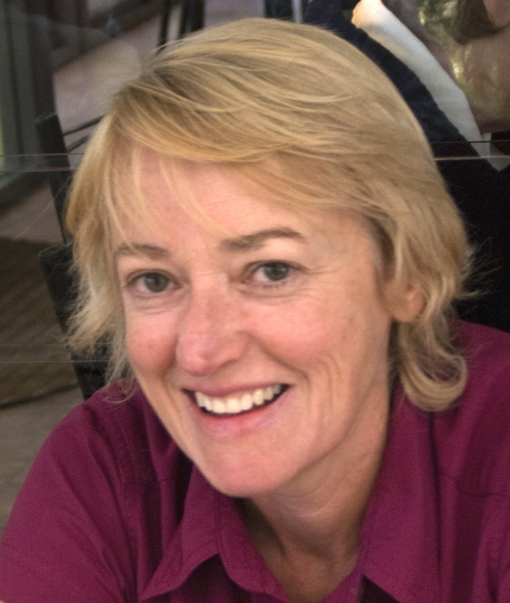
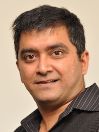
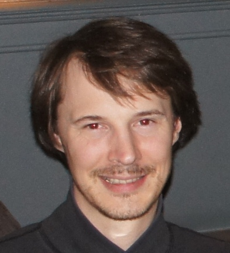
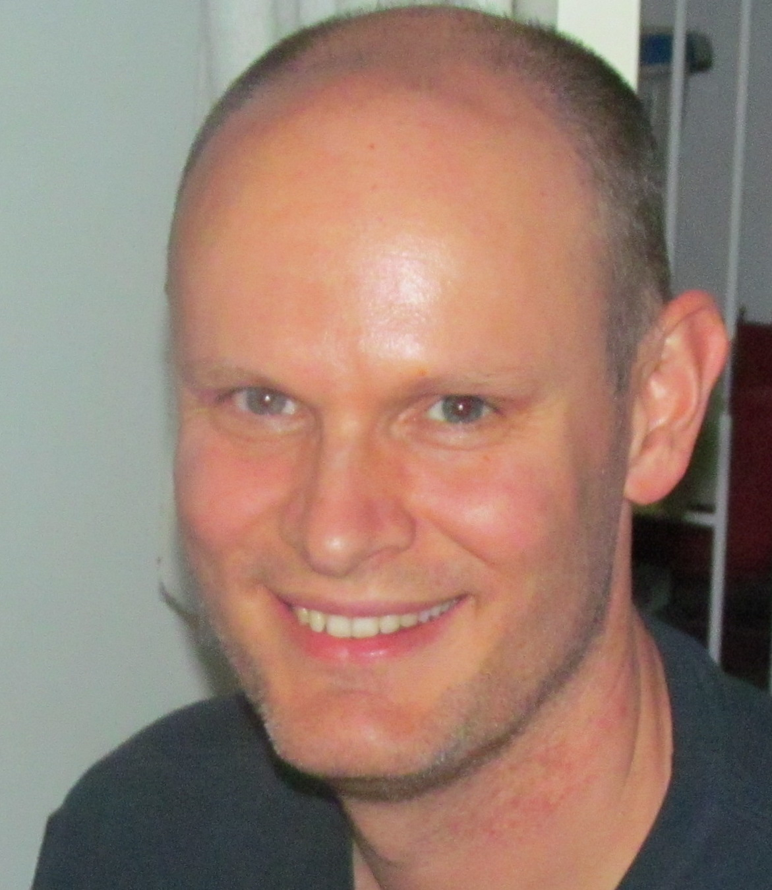
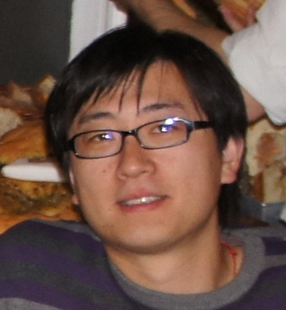
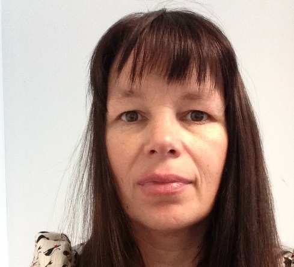
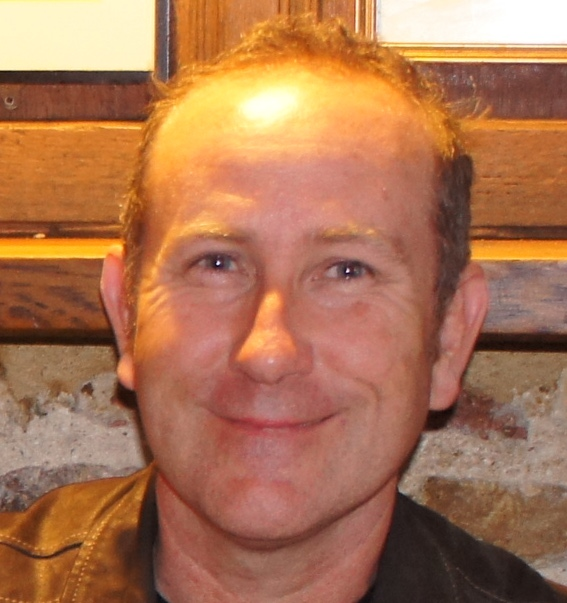
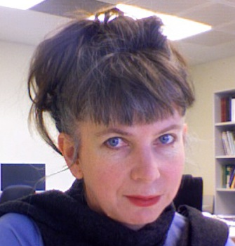
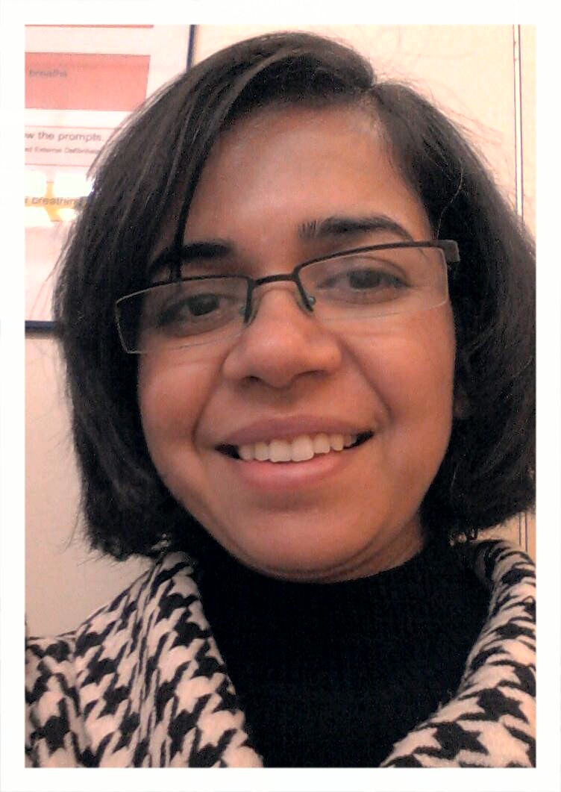
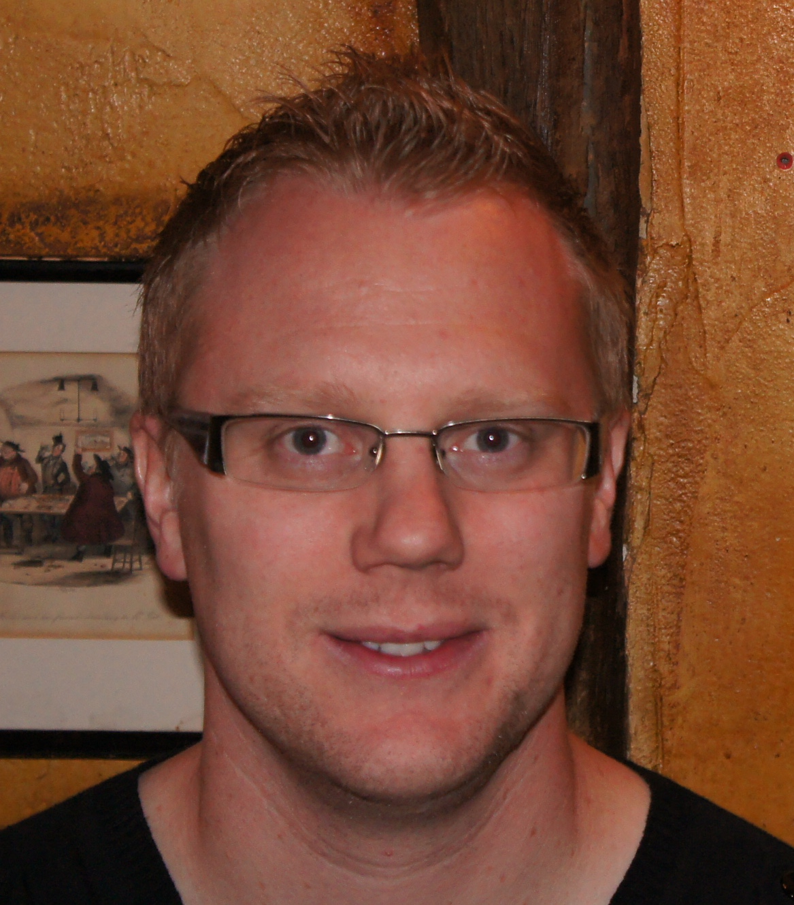

The Trainers
============

\newlength{\trainerIconWidth}
\setlength{\trainerIconWidth}{2.0cm}
+:----------------------------------+:----------------------------------+
| {width=" | **Dr. Zhiliang Chen**             |
| \trainerIconWidth"}               | Postdoctoral Research Associate   |
|                                   | The University of New South Wales |
|                                   | (UNSW), NSW                       |
+-----------------------------------+-----------------------------------+
| {width | **Dr. Susan Corley** Postdoctoral |
| ="\trainerIconWidth"}             | Research Associate The University |
|                                   | of New South Wales (UNSW), NSW    |
+-----------------------------------+-----------------------------------+
| {wi | **Dr. Nandan Deshpande**          |
| dth="\trainerIconWidth"}          | Postdoctoral Research Associate   |
|                                   | The University of New South Wales |
|                                   | (UNSW), NSW                       |
+-----------------------------------+-----------------------------------+
| {widt | **Dr. Konsta Duesing** Research   |
| h="\trainerIconWidth"}            | Team Leader - Statistics &        |
|                                   | Bioinformatics CSIRO Animal, Food |
|                                   | and Health Science, NSW           |
+-----------------------------------+-----------------------------------+
| {width= | **Dr. Matthew Field**             |
| "\trainerIconWidth"}              | Computational Biologist The John  |
|                                   | Curtin School of Medical Research |
|                                   | ANU College of Medicine, Biology  |
|                                   | & Environment, ACT                |
+-----------------------------------+-----------------------------------+
| {width="\t | **Dr. Xi (Sean) Li**              |
| rainerIconWidth"}                 | Bioinformatics Analyst            |
|                                   | Bioinformatics Core, CSIRO        |
|                                   | Mathematics, Informatics and      |
|                                   | Statistics, ACT                   |
+-----------------------------------+-----------------------------------+
| {widt | **Dr. Annette McGrath**           |
| h="\trainerIconWidth"}            | Bioinformatics Core Leader at     |
|                                   | CSIRO Bioinformatics Core, CSIRO  |
|                                   | Mathematics, Informatics and      |
|                                   | Statistics, ACT                   |
+-----------------------------------+-----------------------------------+
| {wi | **Mr. Sean McWilliam**            |
| dth="\trainerIconWidth"}          | Bioinformatics Analyst CSIRO      |
|                                   | Animal, Food and Health Sciences, |
|                                   | QLD                               |
+-----------------------------------+-----------------------------------+
| \centering                        | **Dr. Paula Moolhuijzen**         |
| \arraybackslash                   | Bioinformatics Analyst Centre for |
| \pagebreak                        | Crop Disease Management, Curtin   |
| { | University, WA                    |
| width="\trainerIconWidth"}        |                                   |
+-----------------------------------+-----------------------------------+
| {width= | **Dr. Sonika Tyagi**              |
| "\trainerIconWidth"}              | Bioinformatics Supervisor         |
|                                   | Australian Genome Research        |
|                                   | Facility Ltd, The Walter and      |
|                                   | Eliza Hall Institute, VIC         |
+-----------------------------------+-----------------------------------+
|  | **Dr. Nathan S. Watson-Haigh**    |
| {width="\trainerIconWidth"}       | Research Fellow in Bioinformatics |
|                                   | The Australian Centre for Plant   |
|                                   | Functional Genomics (ACPFG), SA   |
+-----------------------------------+-----------------------------------+
